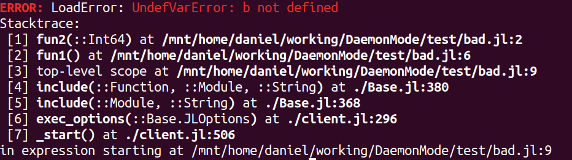

# Posibilities

This package allow users to run its source code a lot faster. However, you could
have doubts about the limitations of running a script through DaemonMode. 

This section is to prove you that you can do more than expected.

## Error Stack

Current version of Daemon can show the Error Stack in a very similar way than
using directly julia. 

- Colors: The message error is remarked using
  [Crayons.jl](https://github.com/KristofferC/Crayons.jl). 

- Number of calls: The calls due to DaemonMode are hidden, to improve  the readibility.

For instance, with the following file bad.jl:

```julia
function fun2(a)
    println(a+b)
end

function fun1()
    fun2(4)
end

fun1()
``` 
Directly with julia:
```sh
$ julia bad.jl
ERROR: LoadError: UndefVarError: b not defined
Stacktrace:
 [1] fun2(::Int64) at /mnt/home/daniel/working/DaemonMode/test/bad.jl:2
 [2] fun1() at /mnt/home/daniel/working/DaemonMode/test/bad.jl:6
 [3] top-level scope at /mnt/home/daniel/working/DaemonMode/test/bad.jl:9
 [4] include(::Function, ::Module, ::String) at ./Base.jl:380
 [5] include(::Module, ::String) at ./Base.jl:368
 [6] exec_options(::Base.JLOptions) at ./client.jl:296
 [7] _start() at ./client.jl:506
in expression starting at /mnt/home/daniel/working/DaemonMode/test/bad.jl:9
```
or in color:


with DaemonMode it gaves:
```
$ julia -e 'using DaemonMode; runargs()' bad.jl
ERROR: LoadError: UndefVarError: b not defined
Stacktrace:
 [1] fun2 at /mnt/home/daniel/working/DaemonMode/test/bad.jl:2
 [2] fun1 at /mnt/home/daniel/working/DaemonMode/test/bad.jl:6
 [3] top-level scope at /mnt/home/daniel/working/DaemonMode/test/bad.jl:9
```

or in color:


## Logging

The script can use Logging. There are two situations:

- The messages are written to a external file. 

- The messages are written to console. 

Both situations are working nicely. For instance, for the file *test_log1.jl*:

```julia
using  Logging, LoggingExtras

function msg()
    @warn "warning 1\nanother line\nlast one"
    @error "error 1"
    @info "info 1"
    @debug "debug 1"
end

msg()
```

running directly with julia:

```sh
$ julia test_log1.jl
┌ Warning: warning 1
│ another line
│ last one
└ @ Main ~/working/DaemonMode/test/test_log1.jl:4
┌ Error: error 1
└ @ Main ~/working/DaemonMode/test/test_log1.jl:5
[ Info: info 1
```
while in color:


running with client:

```julia
$ juliaclient test_log1.jl
 Warning: warning 1
│ another line
│ last one
└ @ Main /mnt/home/daniel/working/DaemonMode/test/test_log1.jl: 4
┌ Error: error 1
└ @ Main /mnt/home/daniel/working/DaemonMode/test/test_log1.jl: 5
┌ Info: info 1
└ @ Main /mnt/home/daniel/working/DaemonMode/test/test_log1.jl: 6
┌ Debug: debug 1
└ @ Main /mnt/home/daniel/working/DaemonMode/test/test_log1.jl: 7
```

or in color:


## Return code

juliaclient defined as:

alias juliaclient='julia --startup-file=no -e "using DaemonMode; runargs()"'

return 

- 0 if the script runs without any problem.
- 1 if there is any unexpected problem.

By example:

```julia
$ jclient hello.jl 
Hello, World!
$ echo $?
0
$ jclient bad.jl 
ERROR: LoadError: UndefVarError: b not defined
Stacktrace:
 [1] fun2 at /mnt/home/daniel/working/DaemonMode/test/bad.jl:2
 [2] fun1 at /mnt/home/daniel/working/DaemonMode/test/bad.jl:6
 [3] top-level scope at /mnt/home/daniel/working/DaemonMode/test/bad.jl:9

$ echo $?
1
```
[](## Parameter Options)

## Async mode

By default, the server only run one task each time. With the optional parameter
async=true to server, the server run each client in a new client.

```sh
$  julia -e 'using DaemonMode; serve(async=true)'
```

This have several advantages:

- You can run any new client without waiting the previous close.

- If one process ask for close the Daemon, it will wait until all clients have
  been finished.

The main drawback is that the @show and logs in console can be send to the last task.


